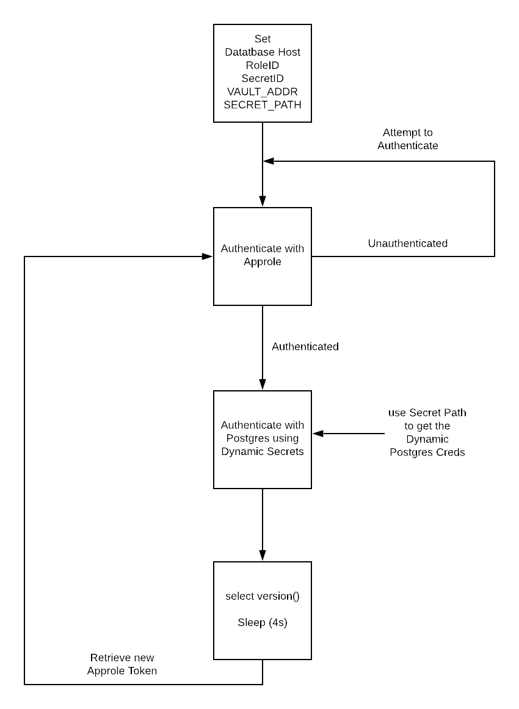

# Vault AppRole Example using Python 

This example provides a simple python application that demonstrates the authentication process of using Vault’s AppRole Auth method to read in the ROLE-ID and the SECRET-ID from two different sources.  We then cover the policy to be attached to the role than allows read access to to a dynamic database secrets backend canonical path (with specified ttl) and reads in a Postgres DB secret for the app the to use.

We also all create a loop in a try block that throws an exception if the following conditions returns true:

1. AppRole Auth token expired and needs to be recreated/renewed

2. Database Secrets token expired and needs to be recreated/renewed

# Workflow diagram

# Testing

Please see [testing.md](testing.md) for Vault configuration and working example steps.

